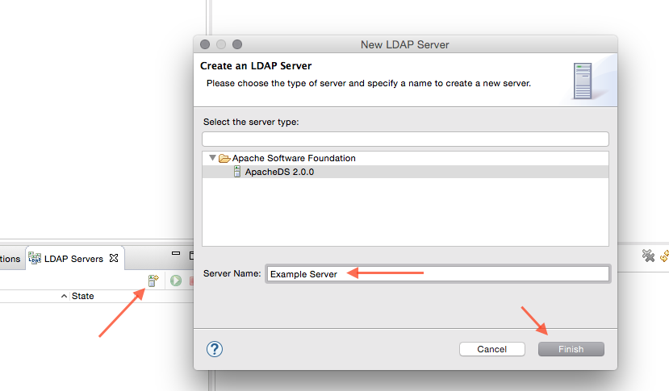
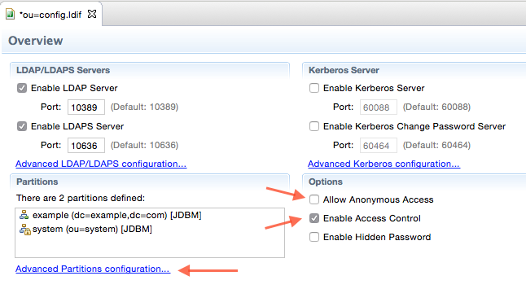
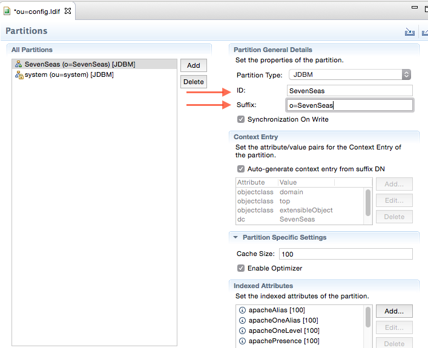
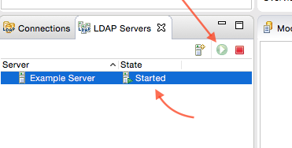
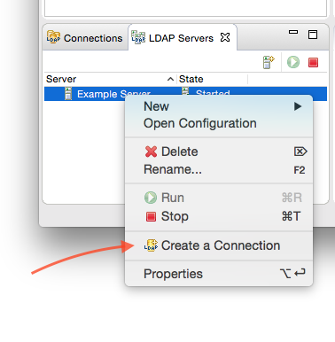
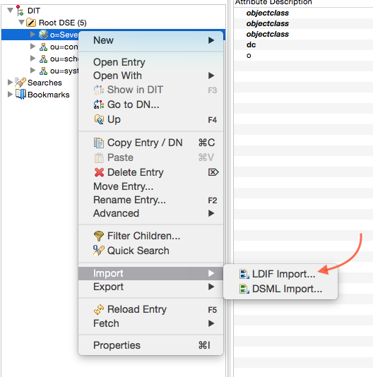
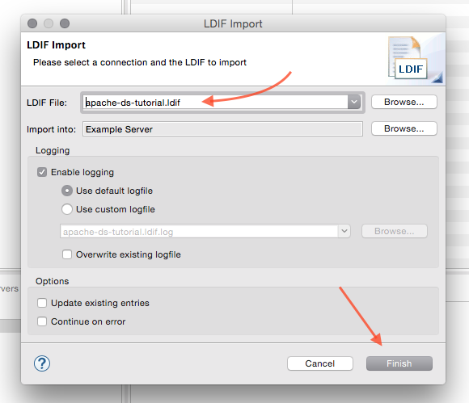
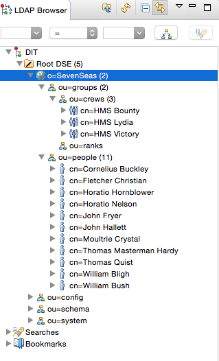

AEM 6.1 LDAP Authentication - Example Setup
===========================================

Requirements
------------
1. Apache Directory Server
2. Example data: http://directory.apache.org/apacheds/basic-ug/resources/apache-ds-tutorial.ldif
3. AEM 6.1

Install Apache Directory Server
-------------------------------
follow the instructions on the apache directory site

#### 1. install apache directory server
folow: http://directory.apache.org/apacheds/basic-ug/1.3-installing-and-starting.html

#### 2. install apache directory studio
see: http://directory.apache.org/studio/

#### 3. create a new server
- In directory studio, select the server tab and click the icon for create server.
- choose some meaningful name and click finish

#### 4. configure server
Doubleclick the newly created server to open its configuration.

- disable anonymous access
- enable access control

- open _Advanced Partions Configuration_
- delete the _example_ partition
- create new partition:
    - for id enter: `SevenSeas`
    - for suffix enter: `o=SevenSeas`

**Save the configuration !!**

#### 5. start the server
Click on the "Start" in the servers tab

#### 6. create connection

right click the server and select _Create a Connection_

#### 7. open connection

double click on the newly created connection in order to connect to the server.

#### 8. import ldif

Import the example data:

- right click on the _o=SevenSeas_ node
- select import -> ldiff

- choose the `apache-ds-tutorial.ldif` file and click _Finish_

#### 9. browse structure

you can verify the newly imported entries

Configure LDAP Authentication in AEM
------------------------------------

DN uid=admin,ou=system and the current password (default is "secret")

