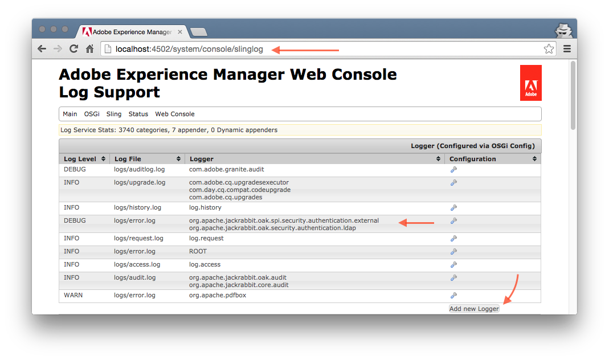
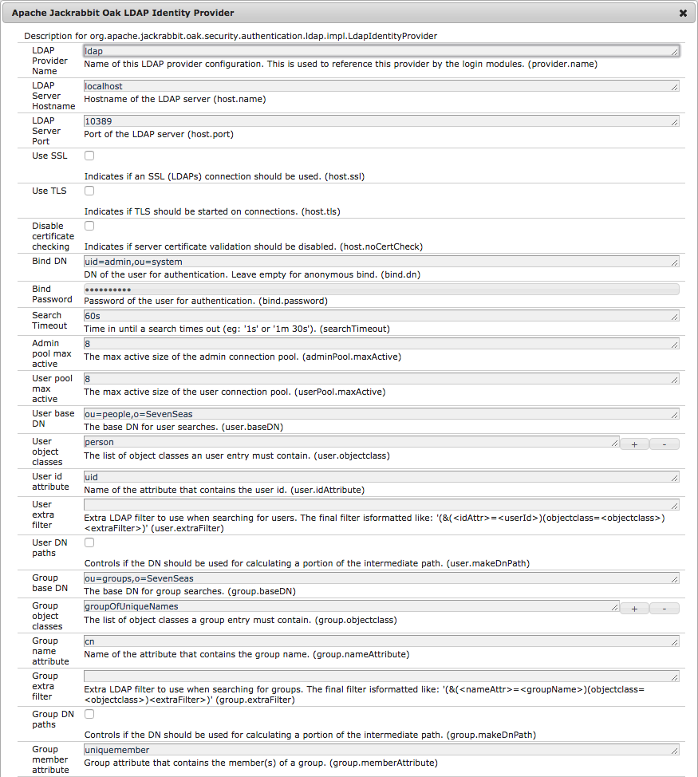
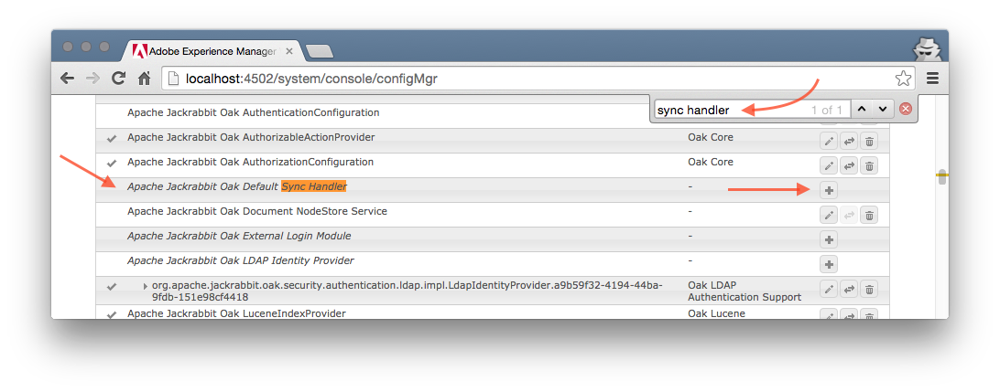
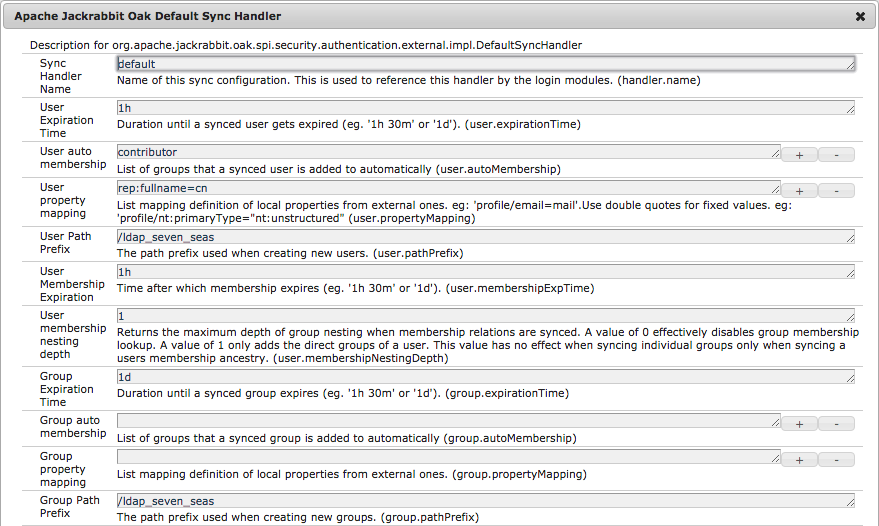

AEM 6.1 LDAP Authentication Tutorial
====================================

Step 02 - Configure LDAP Authentication in AEM
----------------------------------------------

In this step we configure AEM 6.1 to use our newly created LDAP server for login.

**!** If you want to fast forward, here's the [ldap-first-config-pkg.zip](ldap-first-config-pkg.zip) package with the resuling configuration of this step.

### Requirements
1. LDAP Server with example data (preferably from previous step 01)
2. Running vanilla AEM 6.1 installation

#### 1. configure logging
It is always advisable to configure LDAP related logging during initial setup.

- open [Sling Log Support](http://localhost:4502/system/console/slinglog) in the Felix console
- add `org.apache.jackrabbit.oak.spi.security.authentication.external` as category for controlling the logging of the external login module and sync handler
- add `org.apache.jackrabbit.oak.security.authentication.ldap` as category for controlling the logging of the LDAP identity provider.
- optionally, add `org.apache.directory` as a category for very lowlevel logging of the ldap client calls.

#### 2. configure LDAP identity provider
Now we configure the LDAP idp. this is the piece that connects to the LDAP server.

- open the [Felix Configuration Manager](http://localhost:4502/system/console/configMgr) and search for the _"ldap identity provider"_ factory config and click on the plus **+** button.

Enter the following information:

| Name | Value |
|------------------------------|-----------------
| LDAP Provider Name           | `ldap`
| LDAP Server Hostname         | `localhost`
| LDAP Server Port             | 10389
| Use SSL                      | _false_
| Use TLS                      | _false_
| Disable certificate checking	| _false_
| Bind DN                      | `uid=admin,ou=system`
| Bind Password                | `secret`
| Search Timeout               | `60s`
| Admin pool max active        | 8
| User pool max active         | 8
| User base DN                 | `ou=people,o=SevenSeas`
| User object classes          | `person`
| User id attribute            | `uid`
| User extra filter            |
| User DN paths                | _false_
| Group base DN                | `ou=groups,o=SevenSeas`
| Group object classes         | `groupOfUniqueNames`
| Group name attribute         | `cn`
| Group extra filter           |
| Group DN paths               | _false_
| Group member attribute       | `uniquemember`

And save the config.

#### 3. configure Default Sync Handler
The sync handler is responsible to synchronize the external users with the local repository.

- open the [Felix Configuration Manager](http://localhost:4502/system/console/configMgr) and search for the _"Default Sync Handler"_ factory config and click on the plus **+** button.

Enter the following information:

| Name                          | Value
|-------------------------------|--------------------
| Sync Handler Name             | `default`
| User Expiration Time          | `1h`
| User auto membership          | `contributor`
| User property mapping         | `rep:fullname=cn`
| User Path Prefix              | `/ldap_seven_seas`
| User Membership Expiration	 | `1h`
| User membership nesting depth	 | `1`
| Group Expiration Time         | `1d`
| Group auto membership         |
| Group property mapping        |
| Group Path Prefix             | `/ldap_seven_seas`

And save the config

#### 4. configure the external login module
The external login module is the bridge between the login, the idp and the sync handler.

- open the [Felix Configuration Manager](http://localhost:4502/system/console/configMgr) and search for the _"External Login Module"_ factory config and click on the plus **+** button.

Enter the following information:

| Name                   | Value
|------------------------|----------
| JAAS Ranking           | 50
| JAAS Control Flag      | `SUFFICIENT`
| JAAS Realm             |
| Identity Provider Name | `ldap`
| Sync Handler Name      | `default`

And save the config

#### 5. verify the JAAS console
The external login module should now show up in the JAAS console:

- open the [Felix JAAS Console](http://localhost:4502/system/console/jaas)

