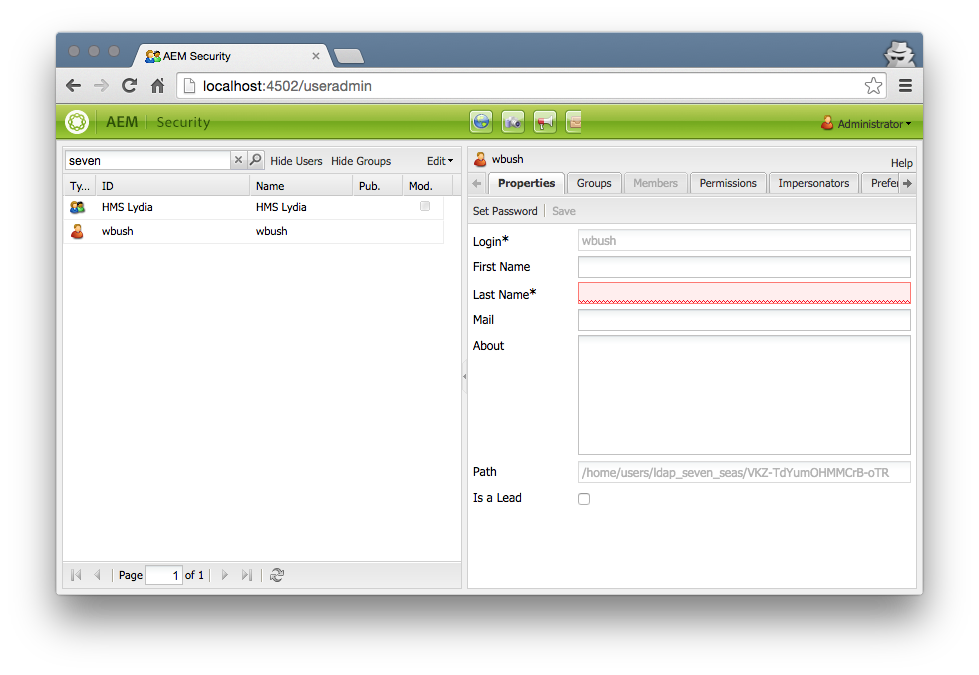
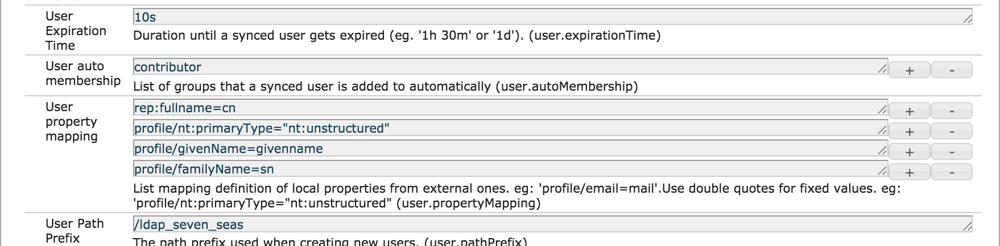
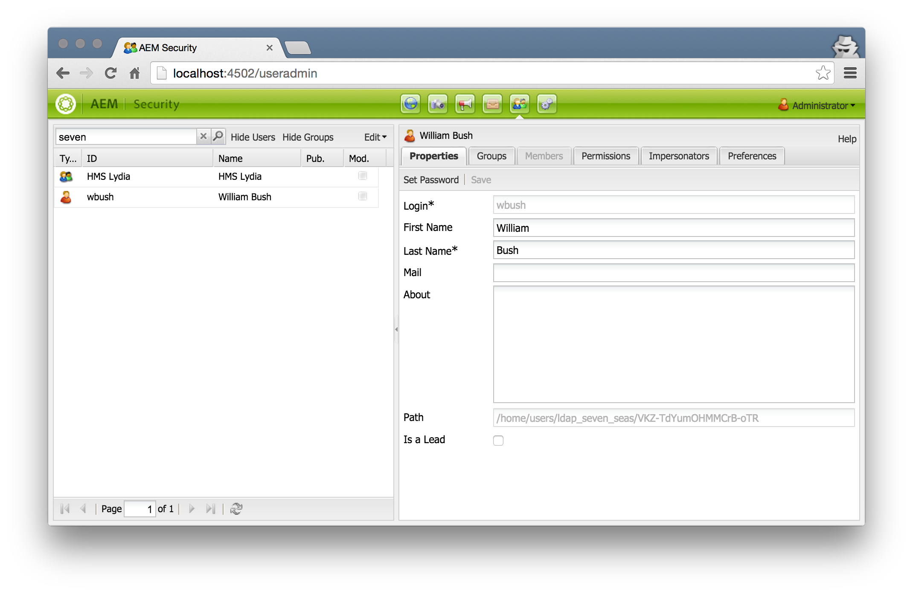
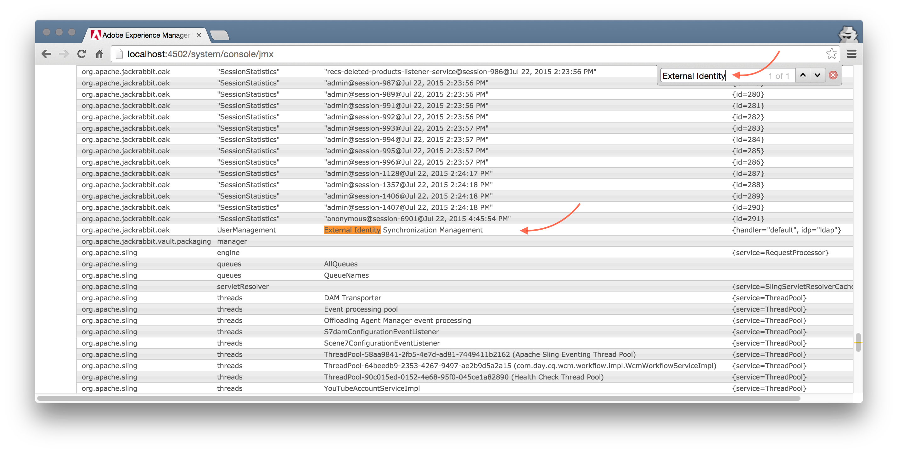
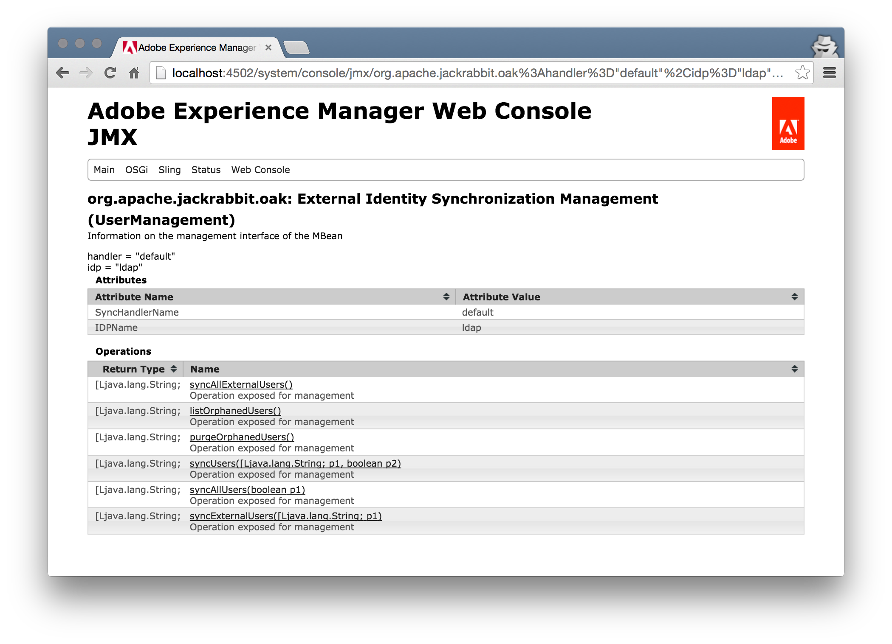
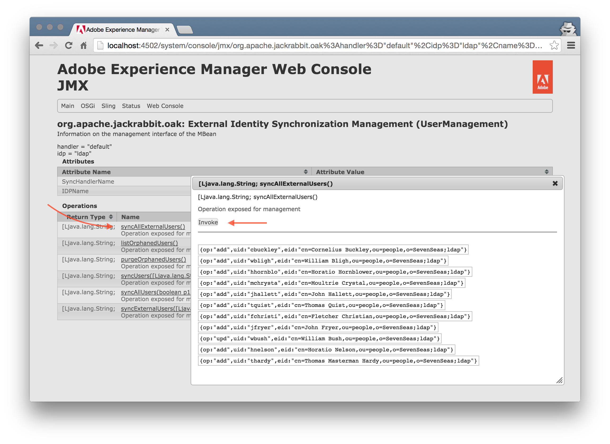
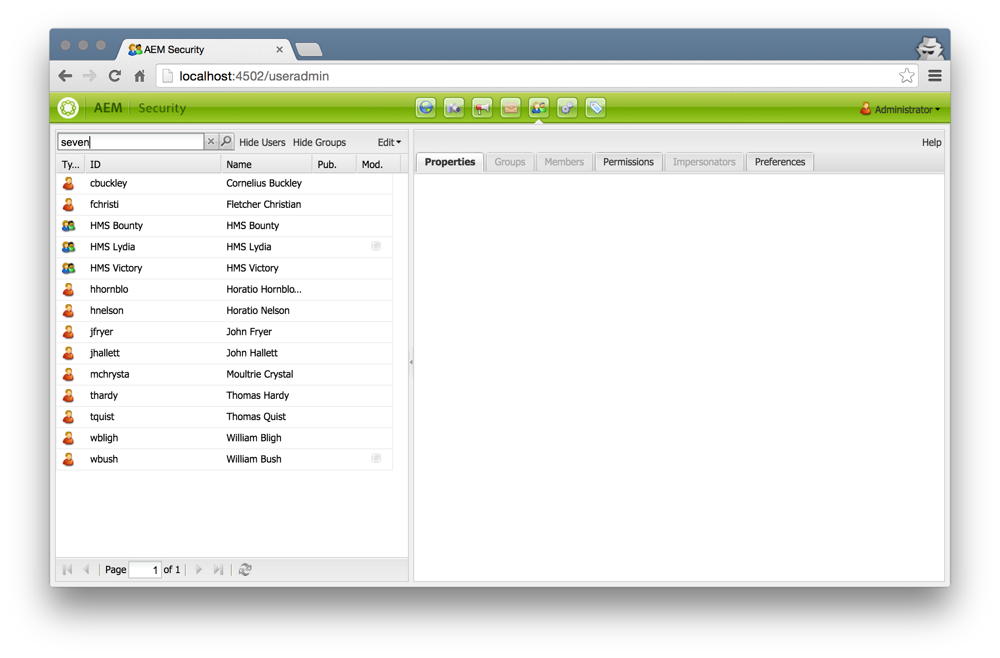

AEM 6.1 LDAP Authentication Tutorial
====================================

Step 03 - Test that it works!
-----------------------------

In this step we verify that the LDAP authentication works and if the users are synced properly.

**!** If you want to fast forward, here's the [ldap-config-with-profile-pkg.zip](ldap-config-with-profile-pkg.zip) package with the resulting configuration of this step.

### Requirements
1. LDAP Server with example data (from step 01)
2. AEM 6.1 installation with configured LDAP authentication (from step 02)

#### 1. simple test - login as a ldap user
The first test is to login as a user that does not exist in the repository but only on the ldap.

- ensure to logout previous session or clear all browser cookie or use a different browser, hostname or IP
- open browser to aem: http://127.0.0.1:4502/
- login as `wbush` with password `pass`

if the login succeeds, you should now see the authoring environment because we configured the `user.autoMembership` to include the `contributor` group.

Looking at the users and groups should show the user _William Bush_ and his group:

- open the [AEM useradmin](http://localhost:4502/useradmin)
- search for `seven`

If you look at the log files, you should see something like this here: [log-snip-01.md](log-snip-01.md)

#### 2. add more config for first- and givenname
As you can see in the AEM user admin, the fields for _First Name_ and _Last Name_ are empty, because the AEM useradmin uses the `profile/givenName` and `profile/familyName` properties.

So let's alter the config so that this information is populated as well.

- open the [Felix Configuration Manager](http://localhost:4502/system/console/configMgr) and search for the _"Default Sync Handler"_ factory config and click on the first confg to edit it

- change the value for _User property mapping_ and add the mappings.
- also lower the value for _User expiration time_ so we can see the effects sooner

Enter the following information:

| Name                          | Value
|-------------------------------|--------------------
| User Expiration Time          | `10s`
| User property mapping         | `rep:fullname=cn`   `profile/nt:primaryType="nt:unstructured"`   `profile/givenName=givenname`   `profile/familyName=sn` |

And save the config.

Now, if you logout and login again with `wbush` the user should be resynced.

#### 3. use JMX console to sync more users
Oak comes with a default JMX mbean that allows you to control the sync handler. 

- open the [Felix JMX Console](http://localhost:4502/system/console/jmx) and search for the _"External Identity"_ bean and select it

- click on `syncAllExternalUsers()` and then on `invoke`. this will collect all the users from the IDP and sync them with the repository. you will see an `add` _op_ property for all newly added users, and an `upd` for the updated ones.

checking back the user admin shows the newly imported users and groups

