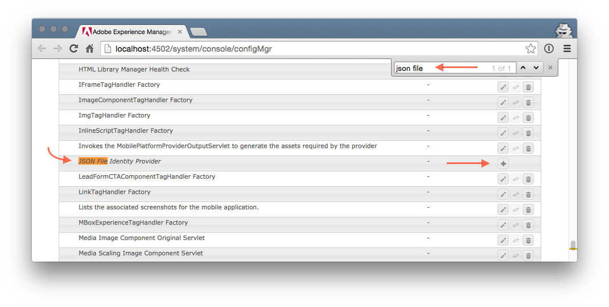
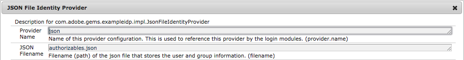
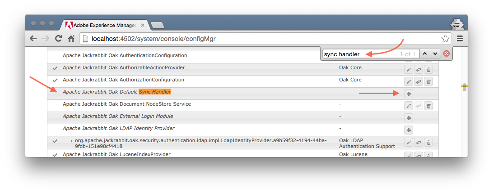
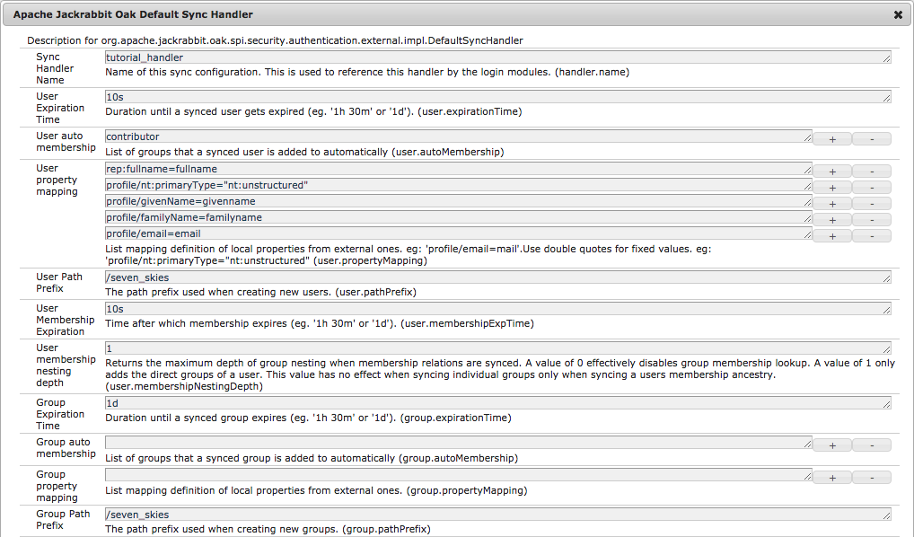
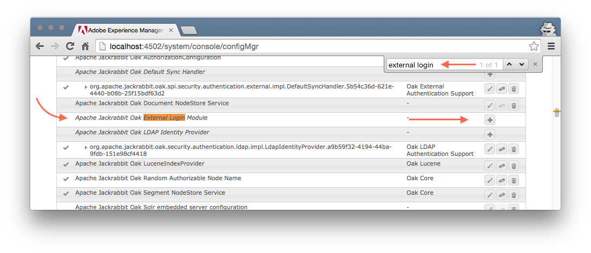
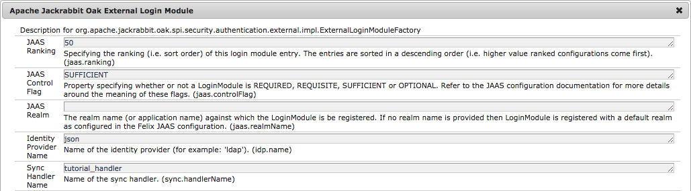
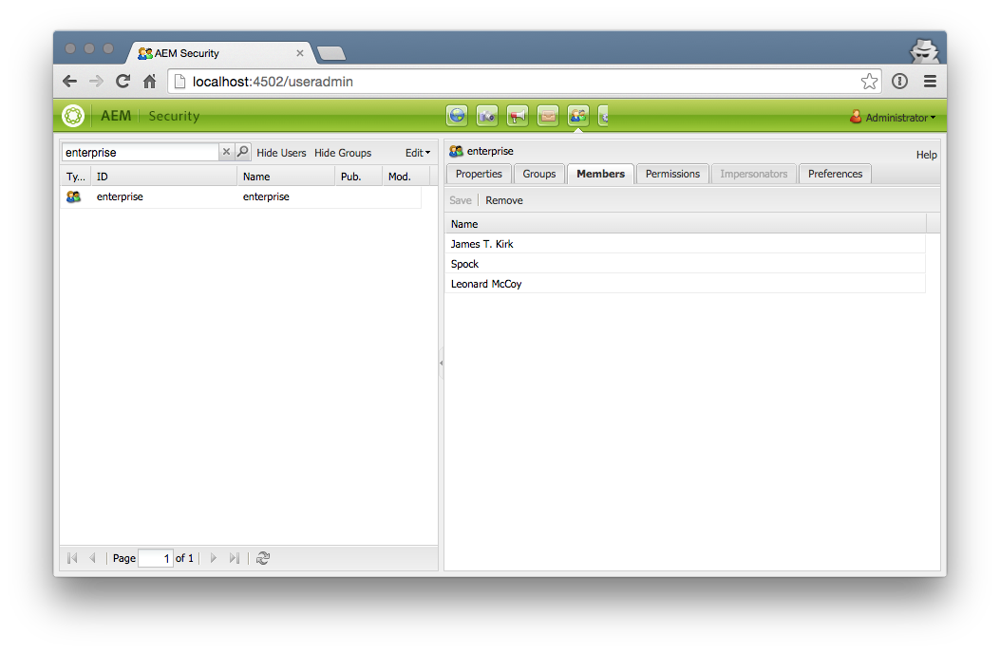

AEM 6.1 Authentication Tutorial Bonus
=====================================

Step 04 - Creating your own IDP
-------------------------------
In this step we show you how to create your own IDP. The IDP provided in this example is very simple as it reads the authorizable data from a JSON file. The sample data in [authorizables.json](authorizables.json) provides the crews of 2 fictional spaceships.

The code for the new IDP is located in the [example-idp](example-idp/) directory. The majority of the code is in the [JsonFileIdentityProvider.java](example-idp/src/main/java/com/adobe/gems/exampleidp/impl/JsonFileIdentityProvider.java) class. The code is very simple and should be self explanatory.

**!** If you want to fast forward, here's the [json-idp-config-pkg](json-idp-config-pkg) package with the configuration. all you need to do is to build and deploy the bundle.

### Requirements
1. Running vanilla AEM 6.1 installation
2. Apache maven

#### 1. build the bundle
- open a terminal or command prompt and navigate into the `example-idp` directory.
- build and install the bundle with `mvn clean install sling:install`

the output should show something like:

````
...
[INFO] ------------------------------------------------------------------------
[INFO] Building AEM 6.1 Gems Example IDP 1.0-SNAPSHOT
[INFO] ------------------------------------------------------------------------
...
[INFO]
[INFO] --- maven-sling-plugin:2.1.0:install (default-cli) @ com.adobe.gems.exampleidp ---
[INFO] Installing Bundle com.adobe.gems.exampleidp(.../example-idp/target/com.adobe.gems.exampleidp-1.0-SNAPSHOT.jar) to http://localhost:4502/system/console via POST
[INFO] Bundle installed
[INFO] ------------------------------------------------------------------------
[INFO] BUILD SUCCESS
[INFO] ------------------------------------------------------------------------
...
````

This will build the bundle and automatically deploy it into an AEM instance running at localhost:4502.

#### 2. configure the identity provider
Similar to the steps when configuring the ldap idp, we need to create a configuration for our new IDP.

- open the [Felix Configuration Manager](http://localhost:4502/system/console/configMgr) and search for the _"json file identity provider"_ factory config and click on the plus **+** button.



Enter the following information:

| Name          | Value
|------------------------------------
| Provider Name | json
| JSON Filename | authorizables.json



#### 3. copy the authorizables json file
As soon as you configure the IDP, you should see a log entry like this:

```
23.07.2015 14:15:15.936 *INFO* [CM Event Dispatcher (Fire ConfigurationEvent: pid=com.adobe.gems.exampleidp.impl.JsonFileIdentityProvider.467a467e-6559-4e40-bb7e-041becb6819e)] com.adobe.gems.exampleidp.impl.JsonFileIdentityProvider json file IDP initialized. using file: /data/develop/cq5/6.1/author/authorizables.json
```

as you can see, the file that the IDP needs is relative to where you started AEM. so copy the sample [authorizables.json](authorizables.json) there.

#### 4. configure the sync handler
Similar to the steps when configuring the sync handler for the ldap idp, we need to create a new configuration here as well.

- open the [Felix Configuration Manager](http://localhost:4502/system/console/configMgr) and search for the _"Default Sync Handler"_ factory config and click on the plus **+** button.



Enter the following information:

| Name                          | Value
|-------------------------------|--------------------
| Sync Handler Name             | `tutorial_handler`
| User Expiration Time          | `10s`
| User auto membership          | `contributor`
| User property mapping         | `rep:fullname=cn` <br> `profile/nt:primaryType="nt:unstructured"` <br> `profile/givenName=givenname` <br> `profile/familyName=familyname` <br> `profile/email=email` |
| User Path Prefix              | `/seven_skies`
| User Membership Expiration	 | `1h`
| User membership nesting depth	 | `1`
| Group Expiration Time         | `1d`
| Group auto membership         |
| Group property mapping        |
| Group Path Prefix             | `/seven_skies`

And save the config. We already add the mappings for the extra profile properties, as we learned in [Step 03](../step-03/tutorial-03-test.md)



#### 5. configure the external login module
As before, the external login module is the bridge between the login, the idp and the sync handler. so add a new configuration that pairs the new `json` idp with the `tutorial_handler` sync handler

- open the [Felix Configuration Manager](http://localhost:4502/system/console/configMgr) and search for the _"External Login Module"_ factory config and click on the plus **+** button.



Enter the following information:

| Name                   | Value
|------------------------|----------
| JAAS Ranking           | 50
| JAAS Control Flag      | `SUFFICIENT`
| JAAS Realm             |
| Identity Provider Name | `json`
| Sync Handler Name      | `tutorial_handler`

And save the config



#### 6. test that it works
- ensure to logout previous session or clear all browser cookie or use a different browser, hostname or IP
- open browser to aem: http://127.0.0.1:4502/
- login as `kirk` with password `pass`

If the login succeeds, you should now see the authoring environment because we configured the `user.autoMembership` to include the `contributor` group.

Looking at the users and groups should show the group _enterprise_ and his member(s):

- open the [AEM useradmin](http://localhost:4502/useradmin)
- search for `enterprise`
- after that, use the JMX console to import the test of the space team!




