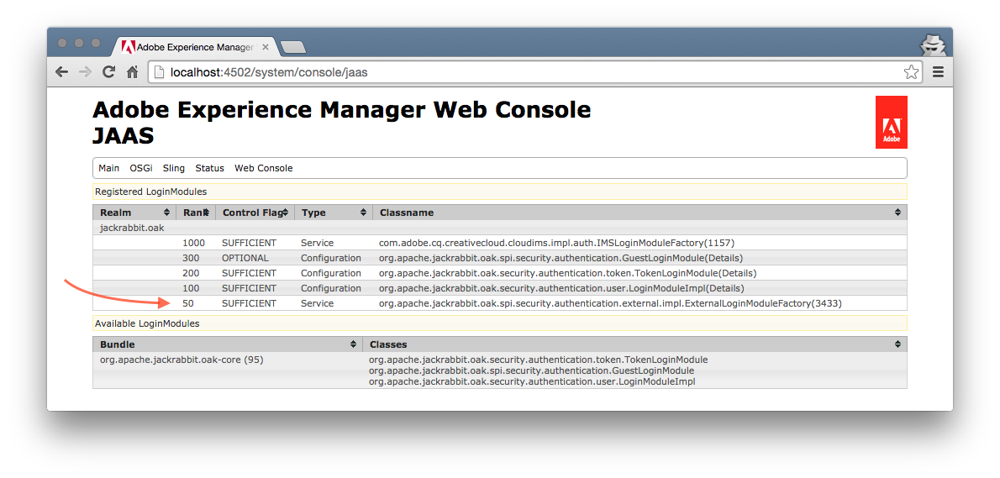

AEM 6.1 LDAP Authentication Tutorial
====================================

((DRAFT))

Step 02 - Configure LDAP Authentication in AEM
----------------------------------------------

In this step we configure AEM 6.1 to use our newly created LDAP server for login.

### Requirements
1. LDAP Server with example data (preferably from previous step 01)
2. Running vanilla AEM 6.1 installation

#### 1. configure logging
It is always advisable to configure LDAP related logging during initial setup.

- open [Sling Log Support](http://localhost:4502/system/console/slinglog) in the Felix console
- add `org.apache.jackrabbit.oak.spi.security.authentication.external` as category for controlling the logging of the external login module and sync handler
- add `org.apache.jackrabbit.oak.security.authentication.ldap` as category for controlling the logging of the LDAP identity provider.

#### 2. configure LDAP identity provider
Now we configure the LDAP idp. this is the piece that connects to the LDAP server.

- open the [Felix Configuration Manager](http://localhost:4502/system/console/configMgr) and search for the _"ldap identity provider"_ factory config and click on the plus **+** button.

Enter the following information:

| Name | Value |
|--------------------|------|
| LDAP Provider Name | `ldap` |
| LDAP Server Hostname	| `localhost` |
| LDAP Server Port	| 10389 |
| Use SSL | _false_ |
| Use TLS | _false_ |
| Disable certificate checking	| _false_ |
| Bind DN | `uid=admin,ou=system` |
| Bind Password	| `secret` |
| Search Timeout | `60s` |
| Admin pool max active	 | 8 |
| User pool max active	| 8 |
| User base DN | `ou=people,o=SevenSeas` |
| User object classes | `person` |
| User id attribute	| `uid` |
| User extra filter	 |  |
| User DN paths	| _false_ |
| Group base DN	| `ou=groups,o=SevenSeas` |
| Group object classes | `groupOfUniqueNames` |
| Group name attribute	| `cn` |
| Group extra filter | |
| Group DN paths | _false_ |
| Group member attribute | `uniquemember` |

And save the config.

#### 3. configure Default Sync Handler
The sync handler is responsible to synchronize the external users with the local repository.

- open the [Felix Configuration Manager](http://localhost:4502/system/console/configMgr) and search for the _"Default Sync Handler"_ factory config and click on the plus **+** button.

Enter the following information:

| Name                          | Value
|-------------------------------|--------------------
| Sync Handler Name             | `default`
| User Expiration Time          | `1h`
| User auto membership          | `contributor`
| User property mapping         | `rep:fullname=cn`
| User Path Prefix              | `/ldap_seven_seas`
| User Membership Expiration	 | `1h`
| User membership nesting depth	 | `1`
| Group Expiration Time         | `1d`
| Group auto membership         |
| Group property mapping        |
| Group Path Prefix             | `/ldap_seven_seas`

And save the config

#### 4. configure the external login module
The external login module is the bridge between the login, the idp and the sync handler.

- open the [Felix Configuration Manager](http://localhost:4502/system/console/configMgr) and search for the _"External Login Module"_ factory config and click on the plus **+** button.

Enter the following information:

| Name | Value |
|--------------------|------|
| JAAS Ranking	| 50 |
| JAAS Control Flag	| `SUFFICIENT` |
| JAAS Realm | |
| Identity Provider Name | `ldap` |
| Sync Handler Name	| `default` |

And save the config

#### 5. verify the JAAS console
The external login module should now show up in the JAAS console:

- open the [Felix JAAS Console](http://localhost:4502/system/console/jaas)

